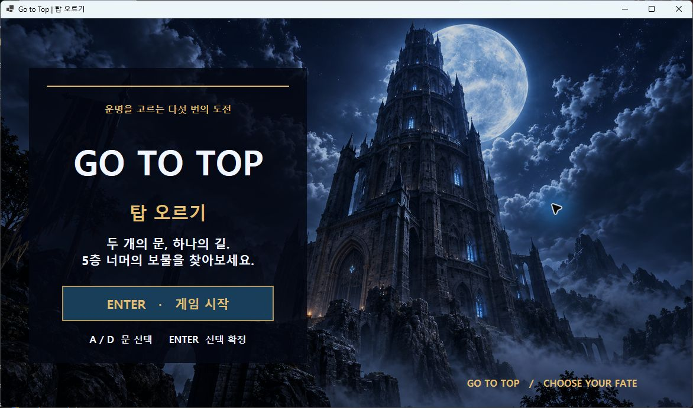
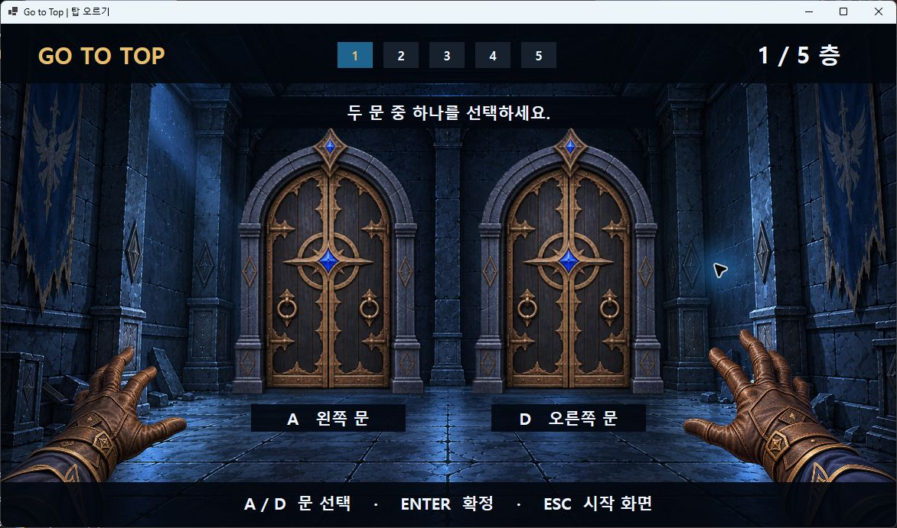
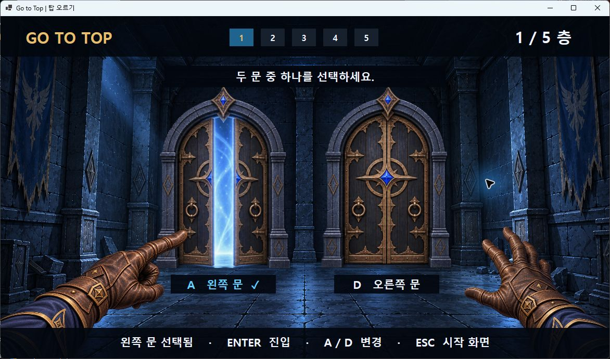
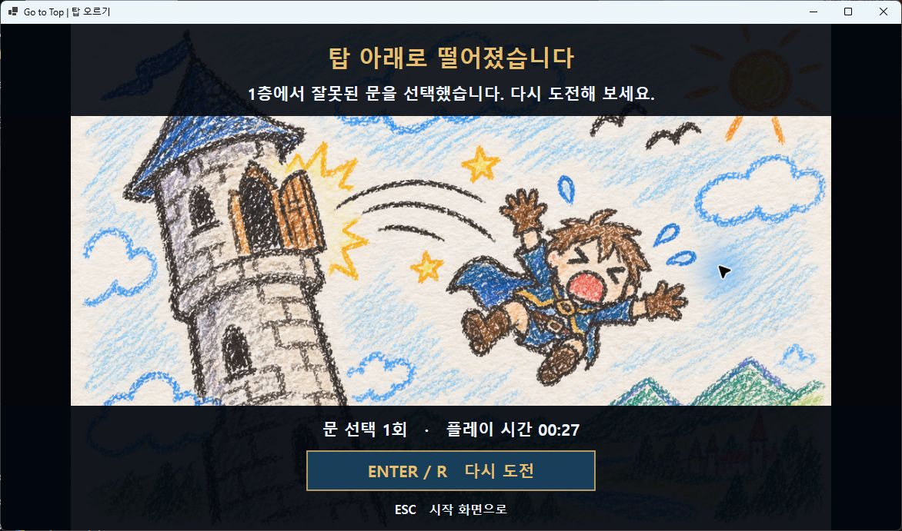

# 3차 과제 — Go to Top

구현일: 2026-09-13

## 과제 요구사항과 구현 위치

| 요구사항 | 구현 |
| --- | --- |
| 그래픽 리소스 준비 및 프로젝트 적용 | 기존 PNG 15개를 `GameScene.Initialize()`에서 로드하고 빌드/게시 폴더로 자동 복사 |
| 실제 게임 화면 출력 | 배경 → 문 → 양손 → UI 순서로 Direct2D 렌더링 |
| 최소한 게임 시작 부분 동작 | 시작 화면에서 Enter → 1층 → A/D 선택 → Enter 진입. 5층 진행 및 승리·실패·재도전까지 구현 |
| Git 태그 제출 | `assignment-3` 태그로 제출 버전 식별 |

## 적용 리소스

| 리소스 | 화면 / 용도 |
| --- | --- |
| `main.png` | 게임 시작 배경 |
| `firstfloor.png` ~ `fifthfloor.png` | 각 층의 배경. 중간 파일명은 `secondfloor`, `thirdfloor`, `fourthfloor` |
| `door_closed.png` | 선택 전 닫힌 문 |
| `door_half.png` | 선택한 문과 푸른 마법광 |
| `door_full.png` | 확정 후 진입하는 문 |
| `leftidle.png`, `rightidle.png` | 양손 기본 자세 |
| `leftselect.png`, `rightselect.png` | 선택한 쪽의 손 자세 |
| `success_ending.png` | 5층 최종 문 통과 시 보물 화면 |
| `fail_ending.png` | 1층 오답 시 실패 화면 |

원본 이미지를 변경하지 않고 화면에서 크기를 조절해 출력합니다.
실패 엔딩 그림은 원본 비율을 유지하기 위해 양옆에 여백을 둡니다.
사운드 리소스는 제공되지 않아 소리는 구현하지 않았습니다.

## 게임 흐름

```text
시작 화면 ─ Enter → 1층
                      ↓
              A / D 문 선택
                      ↓ Enter
         완전히 열림 → 확대 → 페이드
                      ↓
          정답: 상승 / 오답: 하강
                      ↓
     5층 정답: 클리어 / 1층 오답: 게임 오버
                      ↓ Enter 또는 R
                  1층 재도전
```

층에 도착할 때 정답 문을 새로 정합니다. 선택을 바꾸는 동안에는 정답이 바뀌지 않습니다.
Esc로 시작 화면에 돌아간 뒤 Enter를 누르면 새 게임이 시작됩니다.

## 검증 기록

- Debug 및 Release 빌드: 경고 0개, 오류 0개.
- 게임 규칙 검사 7개 통과: 시작/초기화, 선택 변경/중복 확정, 1층 실패,
  하강/재방문 재추첨, 5층 최종 문 통과, 5층 오답/재도전, 진입 중 메뉴 복귀.
- 실제 실행에서 시작 화면, Enter로 1층 진입, A/D 문·손 변경,
  완전히 열린 문과 확대 연출, 게임 오버, R 재도전을 확인.
- Alt+Enter로 전체 화면 전환 시 게임이 재시작되지 않고 현재 화면을 유지함을 확인.
- 실행 폴더의 PNG 15개를 원본과 해시 비교: 누락 0개, 불일치 0개.
- 짧은 입력 누락을 발견해 `G2InputContext`에 KeyDown/KeyUp 이벤트 보관을 추가하고
  동일한 실제 입력으로 시작 및 문 선택이 동작함을 확인.

게임 규칙 자동 검사는 그래픽 창 없이 실행합니다. 자동 검사에서 확인한
5층 클리어 규칙과 실제 창에서 확인한 화면 항목은 위에 구분해 기록했습니다.

## 실행 캡처





