# Game "Go to top" (탑 오르기 게임)
- 시작일: 2026.08.29
- 조작법: A, D

## 1. 게임 개요
두 개의 문 중 하나를 선택하며 탑을 올라가는 간단한 확률 선택 게임이다.
> 100%의 운으로 작용되는 게임이나, 리트라이가 쉽다는 점을 장점삼아 3%의 확률로 게임 클리어에 얼마나 빨리 성공하는지를 주요 경쟁 포인트로 설정했다.

## 2. 게임 목표
각 층에서 올바른 문을 선택하여 총 5개의 층을 통과하여 탑의 보물을 획득하는 것이 목표이다.

## 3. 핵심 규칙
- 각 층에는 두 개의 문이 존재한다.
- 두 문 중 하나만 다음 층으로 이어진다.
- 두 문의 성공 확률은 동일하다.
- 올바른 문을 선택하면 다음 층으로 이동한다.
- 잘못된 문을 선택하면 이전 층으로 이동한다.
- 만일 이전 층으로 갈 수 없는 경우, 게임이 종료된다.
- 5개의 층을 모두 통과하면 게임에 승리한다.

## 4. 게임 진행
게임이 시작되면 플레이어는 현재 층에 있는 두 개의 문 중 하나를 선택한다.

선택한 문이 정답일 경우 다음 층으로 이동하며, 다시 두 개의 문 중 하나를 선택한다.

이 과정을 반복하여 마지막 층까지 통과하면 게임을 클리어한다. 도중에 잘못된 문을 선택하면 이전 층으로 돌아오며, 1층에서 잘못된 문을 선택할 시, 즉시 게임이 종료된다.

## 5. 종료 조건
- 성공: 5개의 층을 모두 통과
- 실패: 1층에서 잘못된 문 선택

## 6. 조작 방법
- 왼쪽 문 선택 [A]
- 오른쪽 문 선택 [D]
- 해당 문을 선택확정 [Enter]
- 선택한 문에 따라 성공 또는 실패 판정

## 7. 화면 구성

게임 화면에는 다음 요소가 표시된다.

- 게임 입장 화면
- 현재 층
- 플레이어 캐릭터의 양손(1인칭 POV)
- 왼쪽 문
- 오른쪽 문
- 게임 진행 결과 (성공 | 실패 화면)

## 8. 필요 리소스

### 이미지
- 플레이어 손 이미지
- 문 이미지
- 문 선택 이미지(플레이어가 선택했을 시, 전환되는 이미지)
- 탑 내부 배경 이미지
- 성공 화면 이미지
- 실패 화면 이미지
- 클리어 화면 이미지

### 사운드
- 문 선택 효과음
- 성공 효과음
- 실패 효과음

## 9. 주요 데이터
- 현재 층
- 정답 문
- 플레이어가 선택한 문
- 게임 종료 여부

## 10. Scene 구성

```구성
1. 메인 화면 Scene
2. 게임 플레이 Scene
3. 게임 종료 Scene
```

---

### 10.1 메인 화면 Scene
- 게임이 실행되면 처음 보이는 시작 화면.
- 게임 시작을 누르면 이후 게임 플레이 Scene으로 전환된다.
- 구성요소 : 게임 시작화면, 시작 선택창

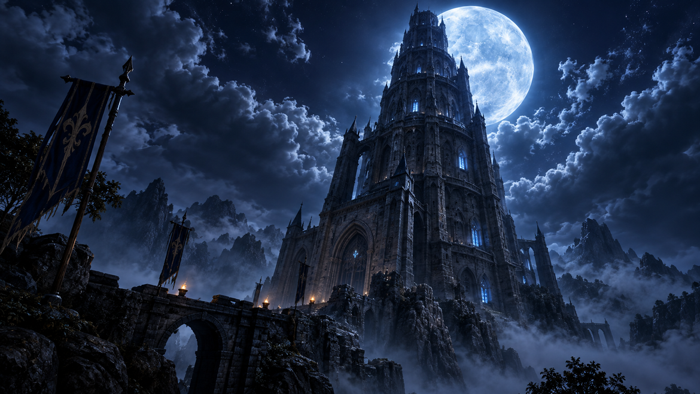

---

### 10.2 게임 플레이 Scene
- 게임이 실행된 이후 보이는 메인 게임 플레이 화면
- 상태 변화
```
1. 기본 상태에서는 두 문이 모두 닫혀 있다.
2. `A` 또는 `D` 입력 시 선택한 문이 살짝 열린다.
3. 열린 틈 사이로 푸른 마법광이 보이며 선택 상태를 표현한다.
4. `Enter` 입력 시 문이 완전히 열린다.
5. 문으로 줌인한 뒤 페이드 효과와 함께 결과를 판정한다.
```

---

### 10.3 게임 종료 Scene
- 5층을 돌파하거나 1층에서 틀린 문을 선택 시 전환되는 화면이다
- 5층을 돌파 시, 게임 클리어 이미지를 출력시킨다
- 1층에서 틀린 문을 선택 시, 게임 오버 이미지를 출력시킨다

---

## 게임 시작 화면


## 층별 배경

### 1층


### 2층
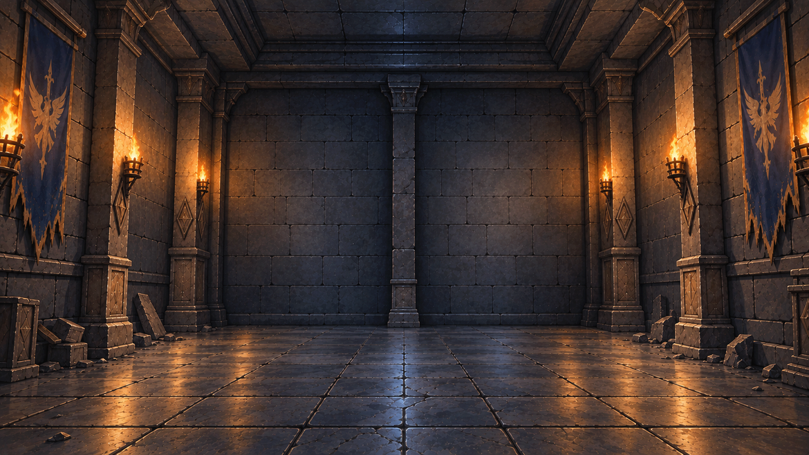

### 3층
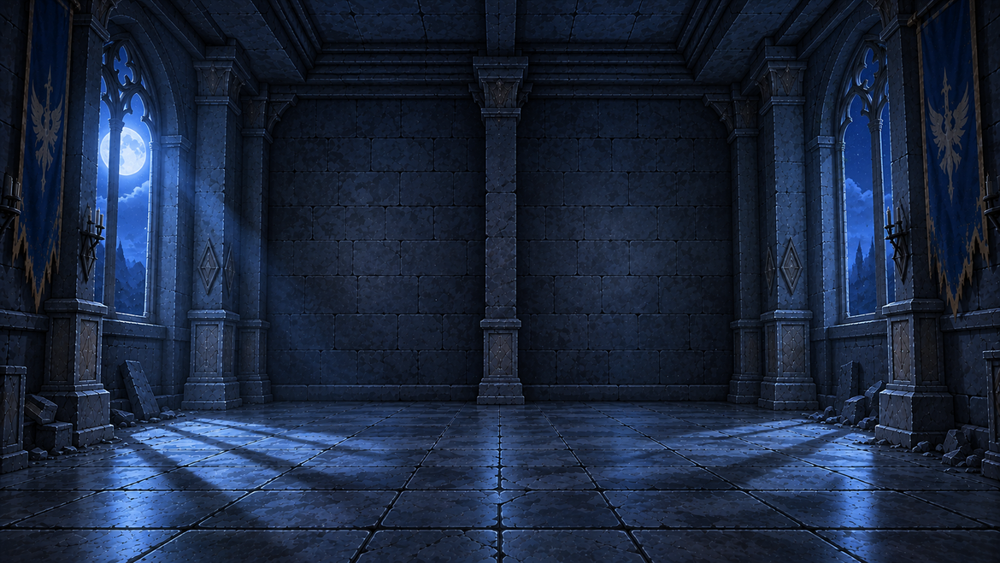

### 4층
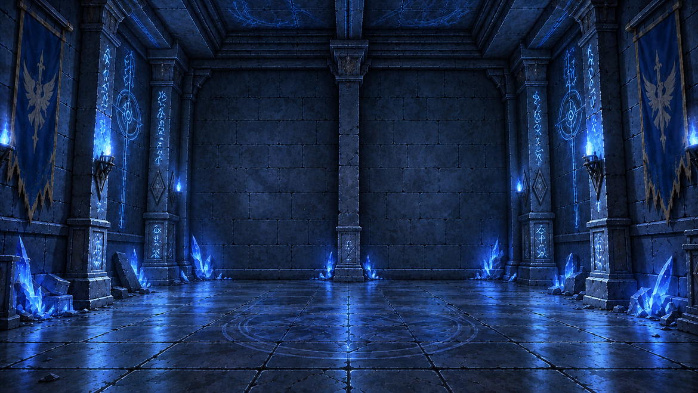

### 5층
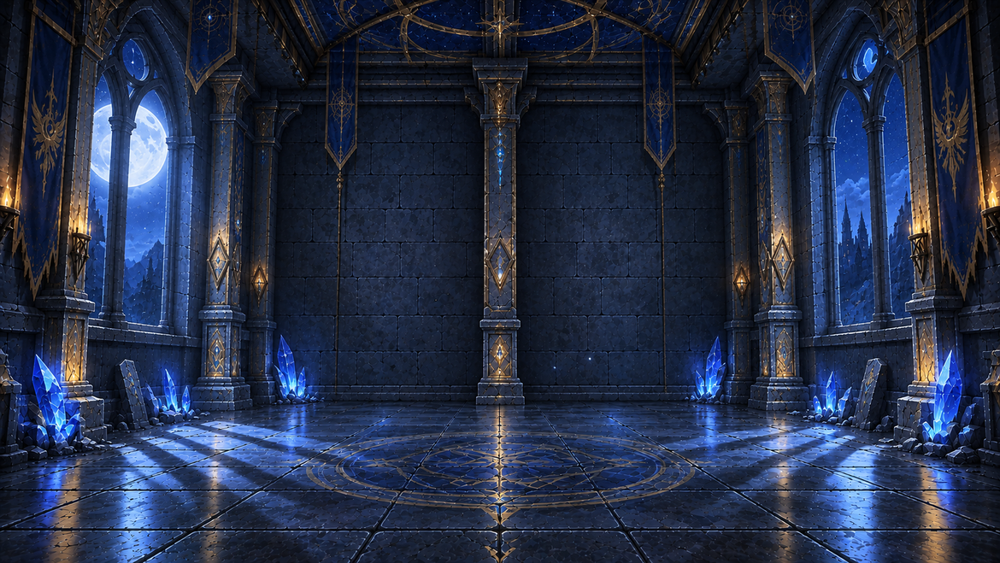


## 문 이미지

### 닫힌 문
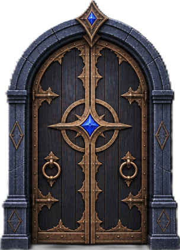

### 선택된 문
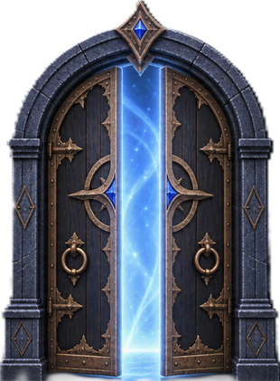

### 완전히 열린 문
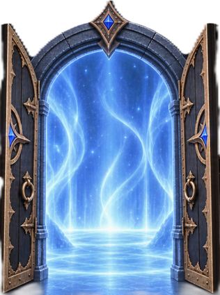


## 플레이어 손

### 왼손 기본
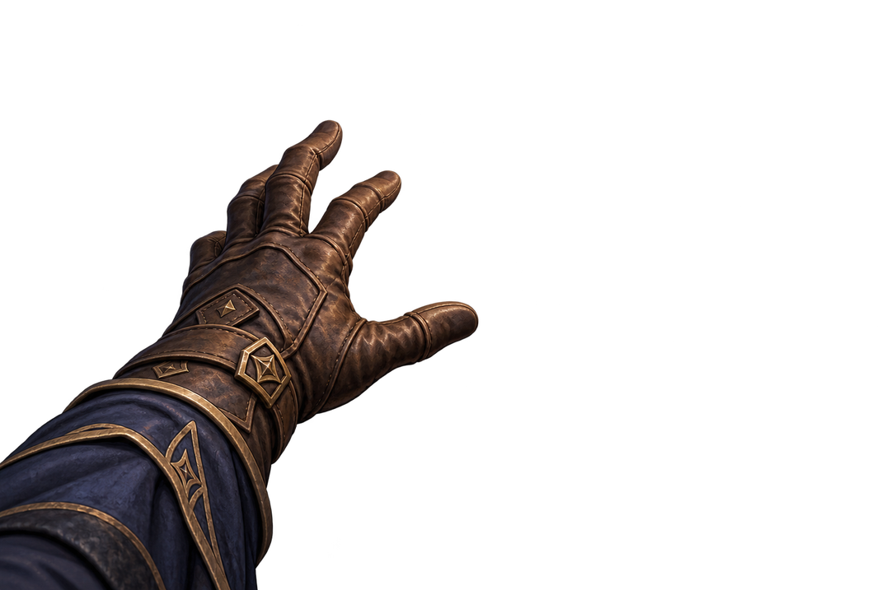

### 왼손 선택
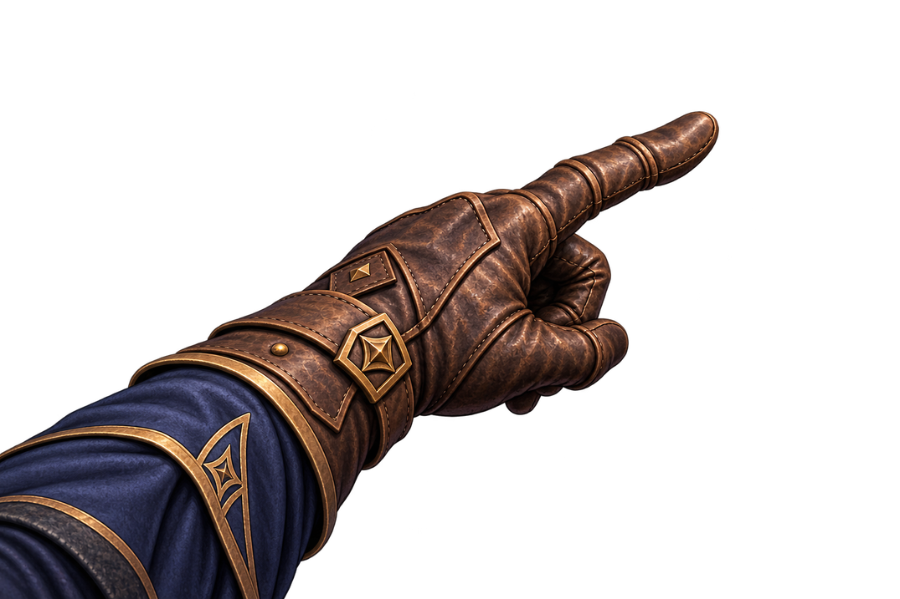

### 오른손 기본
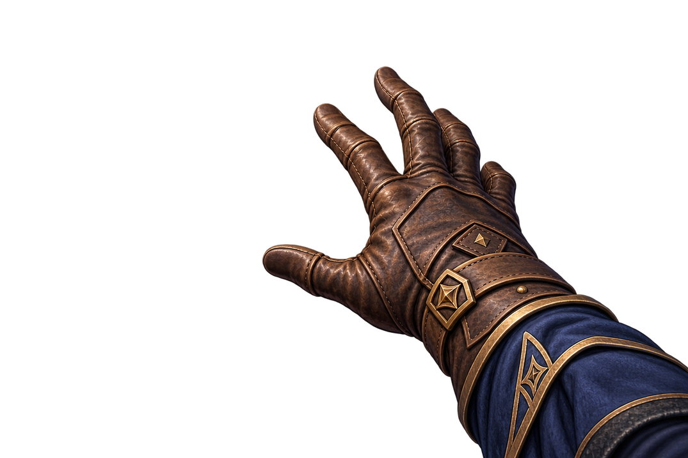

### 오른손 선택
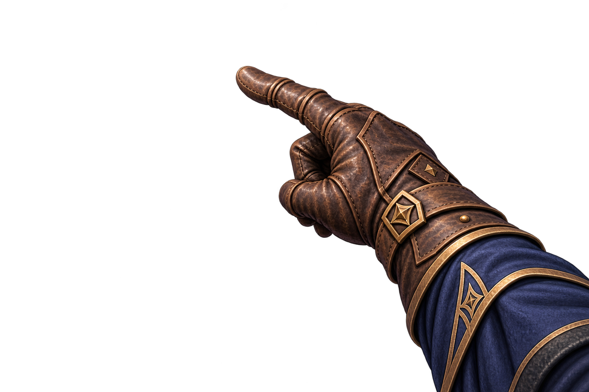


## 결과 화면

### 게임 클리어
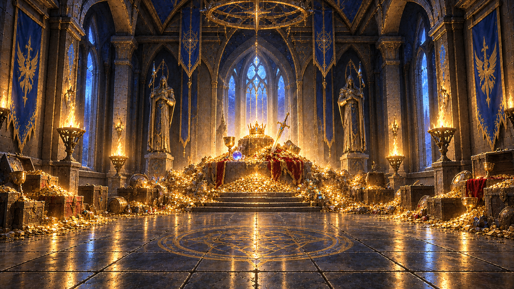

### 게임 오버
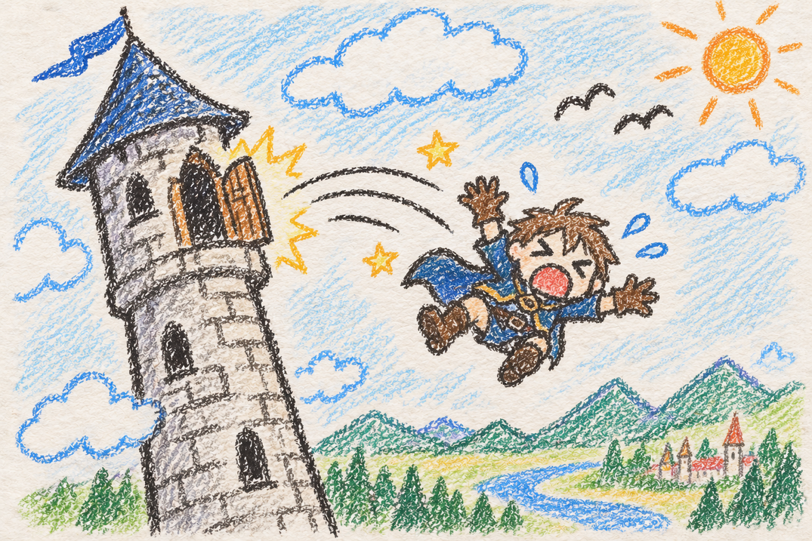

### 문 상태

| 기본 상태 | 선택 상태 | 진입 상태 |
|:---:|:---:|:---:|
|  |  |  |
| 닫힘 | 반쯤 열림 | 완전히 열림 |

### 플레이어 손 상태

| 왼손 기본 | 왼손 선택 | 오른손 기본 | 오른손 선택 |
|:---:|:---:|:---:|:---:|
|  |  |  |  |